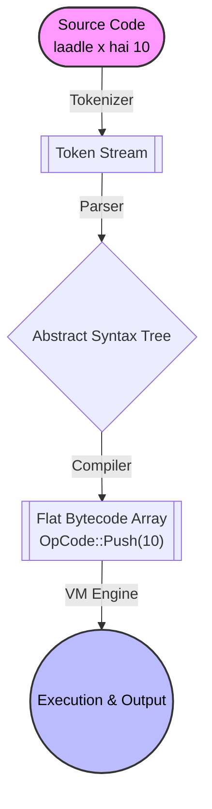

Welcome to **LaadleLang**!

LaadleLang is a custom, statically-typed, bytecode-compiled programming language implemented entirely in Rust. It draws heavily from Pythonic syntax but introduces its own flavor with Hindi/Urdu-inspired keywords. It is built to be simple to read, easy to understand, and highly educational for learning how programming languages and virtual machines work under the hood.

 

---

## Architecture Pipeline

LaadleLang doesn't just evaluate code on the fly; it goes through a rigorous four-phase pipeline before execution. This ensures syntax correctness and allows the runtime execution to be extremely fast.

1. **Token Stream:** The raw text is broken down into meaningful keywords, numbers, and symbols. The tokenizer tracks whitespace to automatically emit `INDENT` and `DEDENT` tokens.
2. **Abstract Syntax Tree (AST):** A recursive descent parser transforms the flat list of tokens into a structured tree of Statements (`Stmt`) and Expressions (`Expr`).
3. **Bytecode:** The compiler walks the tree and flattens it into low-level `OpCode` instructions (like simple Assembly).
4. **Execution:** The custom Virtual Machine reads these opcodes one by one and manipulates its internal memory stacks.

 

---

## Key Features

- **Indentation-Based Syntax**: Like Python, LaadleLang uses whitespace and indentation to denote blocks of code. No curly braces `{}` or semicolons `;` required!
- **Bytecode Virtual Machine**: LaadleLang is compiled down to a custom set of opcodes and executed on a highly optimized, stack-based Virtual Machine (VM).
- **Hindi/Urdu Keywords**: The language uses readable keywords like `laadle`, `hai`, `agar`, `warna`, etc.
- **Dynamic Typing**: Variables can hold integers, floats, booleans, strings, and even functions, with seamless runtime coercions!
- **Robust Error Handling**: Features a proper `try/catch` mechanism implemented via stack unwinding.

 

## Why LaadleLang?

LaadleLang serves as a fantastic playground for both writing fun scripts and understanding language design—covering tokenization, abstract syntax trees (AST), parsing, direct bytecode generation, and virtual machine execution workflows inside Rust.
