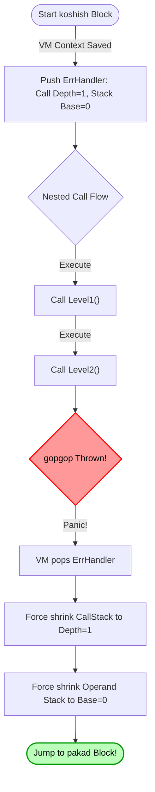

LaadleLang treats errors as exceptional states that can be triggered manually and caught gracefully, rather than crashing the program immediately with ugly internal traces.

## Throwing Errors

To throw an error, use the `gopgop` keyword followed by any value (string, integer, etc.). This immediately stops execution of the current block and begins unwinding the internal call stack back out to find an active handler.

```laadle
kaam divide(a, b) toh
    agar b == 0 toh
        gopgop "Cannot divide by zero!"
    wapas a / b
```

If a `gopgop` is completely unhandled by a parent scope, the Virtual Machine will halt cleanly and print the error message along with the `💥 GopGopError:` prefix.

<br>

---

## Catching Errors (Try / Catch)

To handle potentially dangerous code gracefully, wrap it in a `koshish` (try) block, followed by a `pakad` (catch) block.

```laadle
laadle result hai 0

koshish toh
    result hai divide(10, 0)
    bol "This line won't run"
pakad error_msg toh
    bol "An error occurred:"
    bol error_msg
```

### Stack Unwinding Execution Flow

When an error is thrown inside a deeply nested function call, the Virtual Machine will automatically unwind the nested `CallFrames` and perfectly shrink the operand `stack` back to the exact state it was in when entering the `koshish` block.

This maintains complete memory safety and stack integrity without leaking any local variables defined right before the throw.



After mathematically unwinding the runtime back into safety, the VM jumps execution directly to the `pakad` handler where the thrown error value is cleanly bound to the provided variable.
