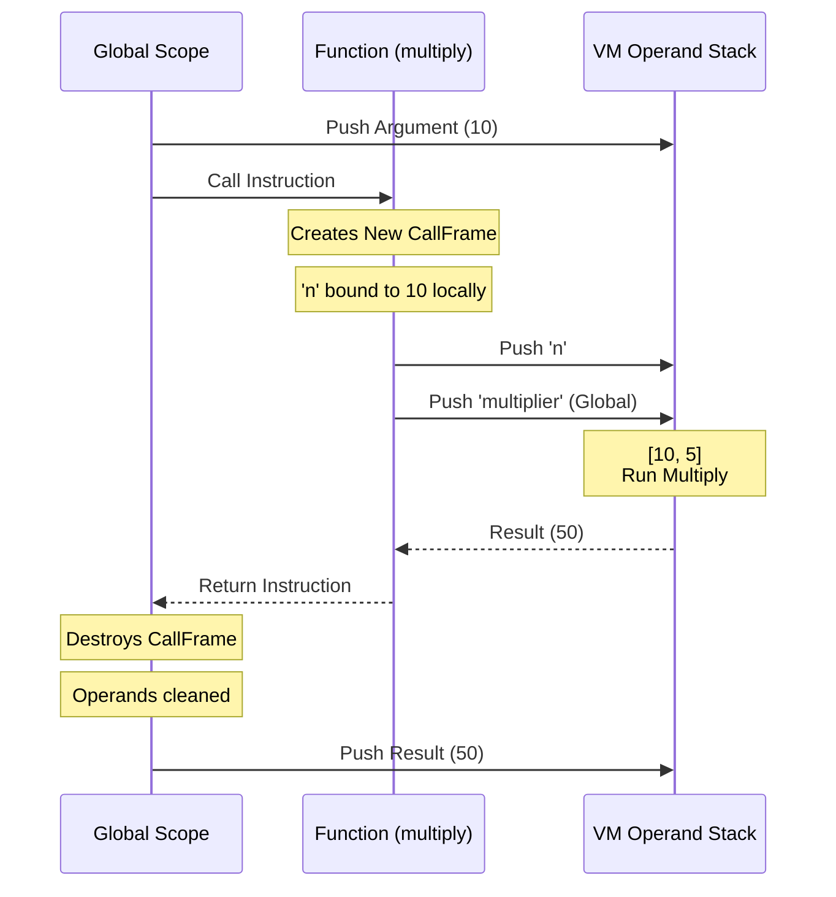

Functions in LaadleLang are first-class citizens declared using the `kaam` keyword.

## Defining a Function

Use `kaam`, followed by the function name, arguments in parentheses, and `toh`.

```laadle
kaam greet(name) toh
    bol "Hello " + name

greet("Alice")
```

<br>

---

## The Call Stack Explained

Every time a function is called, the Virtual Machine pushes a new `CallFrame`. A `CallFrame` is an isolated environment for that function to run safely without corrupting the variables or mathematical calculations of its parent.



<br>

---

## Returning Values

Use the `wapas` (return) keyword to send a value back to the caller. 
If a function reaches the end of its block without returning, it automatically returns `meow` (null).

```laadle
kaam add(a, b) toh
    wapas a + b

laadle sum hai add(5, 10)
bol sum
```

<br>

---

## Scope and Recursion

- **Local Variables**: Variables defined inside a function with `laadle` are strictly local to that specific `CallFrame`. When the function returns, all of its local variables are permanently destroyed.
- **Global Variables**: Functions can still automatically peek outside of their local scope to read global variables defined at the top-level. 
- **Recursion**: Because each call generates a brand new `CallFrame` with fresh isolated memory, functions can safely call themselves recursively!

```laadle
// Recursive factorial
kaam fact(n) toh
    agar n <= 1 toh
        wapas 1
    wapas n * fact(n - 1)

bol fact(5) // Prints 120
```

> **Note on Mutation:** Global variables can be read cleanly, but if you try to assign a value to a variable globally from *inside* a local function without explicitly telling the single-pass compiler, it may accidentally shadow the term by declaring a local variable instead!
