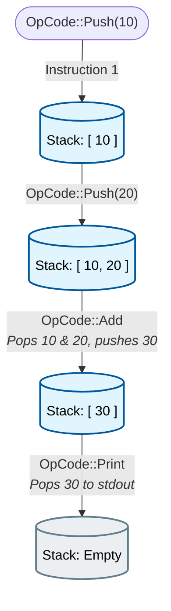

LaadleLang is designed as a fully standalone, end-to-end language implementation. It does not transpile to another language; instead, it compiles directly to custom bytecode and executes on its own tailored Virtual Machine.

Here is the complete execution pipeline:

1. **Tokenizer (Lexer)**: Iterates over raw source code character by character. It implements dynamic tracking of whitespace (like Python) to emit explicit `INDENT` and `DEDENT` tokens when the indentation level changes, allowing blocks to be structured without curly braces.

2. **Parser**: A handcrafted **Recursive Descent** parser. It reads the token stream and builds an **Abstract Syntax Tree (AST)**. The AST uses distinct enums for `Stmt` (Statements, which don't evaluate to a value but perform actions) and `Expr` (Expressions, which always leave exactly one mathematical/logical result on the stack).

3. **Compiler**: A single-pass bytecode compiler. It walks the AST from top to bottom, emitting a flat vector of enum-based `OpCode` instructions. It handles complex control-flow (like `while` jumps and short-circuit evaluation for `&&` and `||`) by backpatching jump addresses.

4. **VM (Virtual Machine)**: A stack-based execution engine (`LaadleVirtualMachineV1`) that evaluates the `OpCode` vector linearly.

 

---

## The Virtual Machine Execution

The VM executes a stack-machine architecture. Instead of storing math outputs in intermediate registers, everything is pushed onto and popped off an `Operand Stack`.

### A Basic Stack Example

For `bol 10 + 20`:

### VM State Components

The VM is extremely lightweight. Its state consists of:

- `program`: The immutable vector of Opcodes.
- `ip`: The Instruction Pointer (current index in `program`).
- `stack`: The Operand Stack (where intermediate math and logic values live).
- `globals`: A Hash Map storing variables and functions defined at the top level.
- `call_stack`: A stack of `CallFrame` structs, managing isolated scope bounds during function calls.
- `err_stack`: A stack of `ErrHandler` structs indicating where to jump and unwind to during a `gopgop` (Throw).

### Call Frames & Scope Isolation

When a function is called, the VM pushes a `CallFrame` containing:

- `return_ip`: Where to jump back to after the function returns.
- `locals`: An isolated `HashMap` for variables inside the function.
- `stack_base`: The length of the operand stack _before_ the function ran.

When the `Return` opcode is reached, the VM safely _truncates_ the operand stack back to exactly `stack_base`, guaranteeing that garbage is not leaked from leftover calculations inside the function body.

 

---

## Detailed OpCode Reference

The LaadleLang VM executes the following instruction set. Every opcode is modeled as a Rust `enum` variant. In the stack effects below, elements are listed left-to-right (the top of the stack is on the right).

### Stack Operations

| Opcode | Stack Effect | Description |
| :--- | :--- | :--- |
| `Push(Value)` | `→ Value` | Pushes a literal (Int, Float, Bool, String, Null) onto the stack. |
| `Pop` | `v →` | Discards the top value on the stack. |
| `Dup` | `v → v, v` | Duplicates the top value on the stack. |
| `Swap` | `a, b → b, a` | Swaps the order of the top two values. |

### Arithmetic

| Opcode | Stack Effect | Description |
| :--- | :--- | :--- |
| `Add` | `a, b → (a+b)` | Adds two numbers, widening Int to Float if mixed. Also concatenates Strings. |
| `Sub` | `a, b → (a-b)` | Subtracts `b` from `a`. |
| `Mul` | `a, b → (a*b)` | Multiplies `a` and `b`. |
| `Div` | `a, b → (a/b)` | Divides `a` by `b`. Triggers a Rust panic on integer division by zero. |
| `Neg` | `a → -a` | Unary negation. Flips the mathematical sign of `a`. |

### Logic & Comparison

| Opcode | Stack Effect | Description |
| :--- | :--- | :--- |
| `Not` | `a → !a` | Unary NOT. Converts `a` to its truthy/falsy boolean equivalent, then flips it. |
| `And` / `Or` | `a, b → bool` | Logical AND / OR. Computes the logical constraint. _(Note: The compiler short-circuits these using Jumps instead of emitting the raw opcodes!)_ |
| `Eq` / `Neq` | `a, b → bool` | Evaluates if `a == b` or `a != b`. Works securely across distinct Types. |
| `Gt` / `Lt` | `a, b → bool` | Evaluates greater-than (`>`) or less-than (`<`). |
| `Gte` / `Lte` | `a, b → bool` | Evaluates greater-than-or-equal (`>=`) or less-than-or-equal (`<=`). |

### Variables (Scope)

| Opcode | Stack Effect | Description |
| :--- | :--- | :--- |
| `SetGlobal(Name)` | `v →` | Pops `v` and stores it strictly into the global `HashMap` under `Name`. |
| `GetGlobal(Name)` | `→ v` | Fetches `Name` from the global `HashMap` and pushes it. |
| `SetLocal(Name)` | `v →` | Pops `v` and stores it into the purely internal `CallFrame`'s local variables scope. |
| `GetLocal(Name)` | `→ v` | Fetches `Name` from the inner `CallFrame`'s block scope variables. If not explicitly declared, seamlessly traverses outwards to `GetGlobal`. |

### Control Flow

| Opcode | Stack Effect | Description |
| :--- | :--- | :--- |
| `Jump(Addr)` | `→` | Unconditionally forcefully sets the Instruction Pointer (`ip`) to absolute `Addr`. |
| `JumpIfFalse(Addr)` | `cond →` | Pops the condition. If falsy, branches execution `ip` to `Addr`. Primarily constructs `agar` (if) statements and `jabtak` (loops). |
| `JumpIfTrue(Addr)` | `cond →` | Pops the condition. If truthy, sets `ip` to `Addr`. |

### Functions

| Opcode | Stack Effect | Description |
| :--- | :--- | :--- |
| `MakeFunction` | `→` | Registers a function descriptor (`name`, `addr`, `params`) directly into the global table. |
| `Call {n, argc}` | `args... →` | <ul><li>Pops `argc` dynamic arguments off the stack</li><li>Fetches the declared function from globals</li><li>Creates new `CallFrame` and binds arguments</li><li>Hops pointer to subroutine block `addr`</li></ul> |
| `Return` | `v → v` | <ul><li>Pops the return variable `v`</li><li>Destroys the isolated `CallFrame` container</li><li>Truncates the runtime stack to prevent leaks</li><li>Restores jump instruction pointer `ip`</li><li>Pushes `v` exactly once back onto the stack</li></ul> |

### Input / Output

| Opcode | Stack Effect | Description |
| :--- | :--- | :--- |
| `Print` | `v →` | Pops `v` and forwards it directly to the console terminal via `bol`. |

### Exceptions & Errors

| Opcode | Stack Effect | Description |
| :--- | :--- | :--- |
| `PushErrHandler(A)` | `→` | <ul><li>Pushes an `ErrHandler` to the VM error stack</li><li>Records the `catch` block jump address `A`</li><li>Snapshots the current Call Stack depth</li><li>Snapshots the current Operand Stack base length</li></ul> |
| `PopErrHandler` | `→` | <ul><li>Pops the innermost `ErrHandler` state</li><li>Signals the successful completion of a `koshish` (try) block</li></ul> |
| `Throw` | `v →` | <ul><li>Pops the thrown error value `v`</li><li>Shrinks Call Stack to safely escape nested functions</li><li>Shrinks Operand Stack back to safety</li><li>Pushes `v` back into memory</li><li>Jumps to the `pakad` block using `gopgop` logic</li></ul> |

### Lifecycle

| Opcode | Stack Effect | Description |
| :--- | :--- | :--- |
| `Halt` | `→` | Safely evaluates logic end-to-end terminating entire Virtual Machine main core thread cycle. |
| `Noop` | `→` | <ul><li>Does exactly nothing</li><li>Retains padding for compiler backpatch jumps</li></ul> |
